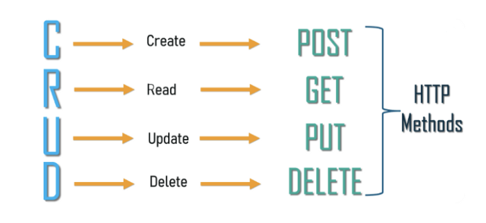

<h1 align="center">
  CRUD NodeJs
</h1>

<p align="center">
  <a href="#features">Features</a> | <a href="#testing-application-locally">Start server</a> | <a href="#use-the-api">Use the API</a> | <a href="#testing-the-application-curl">Testing the application</a> | <a href="#project-structure">Project structure</a> | <a href="#how-to-contribute">How to contribute</a> | <a href="#license">License</a>
</p>

<p align="center">
  
  
  
  
</p>

> __Project:__ The idea of this project is to create a CRUD applying the theory of a REST API, Clean code. To develop this project I use Nodejs and SQL. Read about [CRUD](https://github.com/abantes/crud-nodejs#crud-operations-explained-by-avelon-pang) at the end of this README.
  
## Features

- [X] Create crud operations using http verbs;
- [X] Create database connection;
- [ ] Deploy;
- [ ] Rfactor;

## Testing application Locally

In development I used `yarn` manager, but you can use any other. You just adapt the commands to your manager:

```console
# Clone this repository
$ git clone https://github.com/abantes/crud-nodejs.git

# Access the project folder in the cmd/terminal
$ cd crud-nodejs

# Install the dependencies
$ yarn

# Run the application in development mode
$ yarn dev

# Access http://localhost:3333
```

## Use the API

When the server is running, you can consume the API this way:

```js
async function getContent() {
  try {
    const response = await fetch('http://localhost:3333')
    const data = await response.json()
    
    console.log(data)
  } catch (error) {
    console.log(error)
  }
}

getContent()
```

## Testing the application (curl):

```
# Read all users:
curl -X GET http://localhost:3333/

# Read user by ID:
curl -X GET http://localhost:3333/ID

# Create a user
curl -d '{"name": "NAME", "username": "USERNAME"}' -H "Content-type: application/json" -X POST http://localhost:3333/

# Edit a user
curl -d '{"username": "NEWNAME"}' -H "Content-type: application/json" -X PUT http://localhost:3333/ID

# Delete a user
curl -X DELETE http://localhost:3333/ID
```

## Project structure

The project code base is mainly located within the src folder. This folder is divided in:

* `database`: Contains database management;
* `routes`: Contains system routing.

```
.
├── .github                    # Github configurations
├── src
│   ├── database               # Project datasabe
│   │   ├── CreateTable.ts     # Datbabase conection
│   │   └── database.sqlite    # Database file
│   │
│   ├── routes                 # Project Routes
│   │   ├── CreateUser.ts      # Create user function
│   │   ├── DeleteUser.ts      # Delete user function
│   │   ├── EditUser.ts        # Edit user function
│   │   ├── GetAllUsers.ts     # Read users function
│   │   └── GetUser.ts         # Read user function
│   │
│   ├── app.ts                 # Import server routes
│   └── server.ts              # Server configurations
│
├── tsconfig.json              # Typescript configuration
└── package.json               # Dependency manager
```

## How to contribute

Contributions are always welcome, no matter how large or small.

1. Fork this repository;
2. Create a branch with your feature: **`git checkout -b my-feature`**;
3. Commit your changes: **`git commit -m 'feat: My new feature'`**;
4. Push to your branch: **`git push origin my-feature`**.

__After the merge of your pull request is done, you can delete your branch.__

You can report a bug [here](https://github.com/abantes/fylo/issues).

## License

This project is under the MIT license. See the archive [LICENSE](LICENSE.md) for more details.

## CRUD Operations Explained (By [@Avelon Pang](https://medium.com/geekculture/crud-operations-explained-2a44096e9c88))


### What is CRUD?

If you are new to programming, seeing “CRUD” in the title may raise concerns considering that the Merriam-Webster dictionary defines crud as either “a deposit or incrustation of grease or a slang for a contemptible person.” As fun as it may be to expand on that definition, this is not what we will be expanding on for this article. In the computer programming world, CRUD is an acronym worth knowing. We will review what CRUD operations (aka CRUD functionalities) are and why it is an important fundamental to learn early on.

__CRUD__ is an acronym that stands for Create, Read, Update and Delete.Think of CRUD as a simple concept that represents the four basic functions that models should be able to do and are considered necessary to implement a persistent storage application. In simpler terms, it represents the four basic operations you can do on any data. You can create something new, read or view the newly created data, edit or update the data and finally the option to delete it.



### CRUD Functions

These four major functions are used to interact with database applications and is a reminder of what data manipulation functions are needed for an application to feel complete. When working with web services, CRUD corresponds to the to HTTP methods, which communications to a web server how you want to interact with a website.

In this breakdown, I will use my New Beginnings project as an example for the CRUD functions and the HTTP requests associated with them. This was my first (Ruby/HTML) application that was built for a local animal shelter where users can create an account, log in, browse all animals for adoption and schedule playdates or adopt them directly from the site.

#### Create

After logging into the New Beginnings site, browsing all the animals available for adoption, we’d click on Togo’s name. Once we’ve been directed to his show page, we can create a playdate with him at the shelter. After we complete the appointment form, those inputs are then correlated to the model table in the database. When we submit the data, a POST requested is sent to our API and our playdate with Togo will be stored in the database.

* The route for this POST request — /appointments/new

#### Read

Nice! We’ve scheduled our playdate with Togo, but now we want to see that confirmation on our page right? After all, read is the main functionality for us to use the other operations. Now, our API should allow us to see the playdate confirmation on our page. To take a look at all of our appointments, we would use a GET request that allows us to view the scheduled appointment without making any changes to the data stored on our API. This HTTP method is used to only retrieve data and should have no other effects.

* The route for this GET request — /appointments.

#### Update

Togo is really adorable, maybe we should see him sooner! For us to reschedule the appointment for an earlier time we can use the corresponding HTTP method for updating your playdate with PUT. This replaces all current data of the target resource (Togo) with the uploaded content (new appointment time/date). The ‘id’ in the route is how the resource is targeted (Togo) to ensure we only update the specified appointment, while leaving any others we may have scheduled untouched.

* The route for this PUT request — /appointments/:id.

#### Delete

You know what? Togo has been so helpful with these CRUD functionalities, I think we should just bring him home. Since we can adopt Togo directly from the app, let’s go ahead and cancel the playdate we scheduled. To do this, we can use the HTTP method, DELETE, to remove the targeted appointment from our page. To reiterate, each playdate has a unique id and the id in the request below identifies the specific appointment you are removing from the database.

* The route for the DELETE request — /appointments/:id
